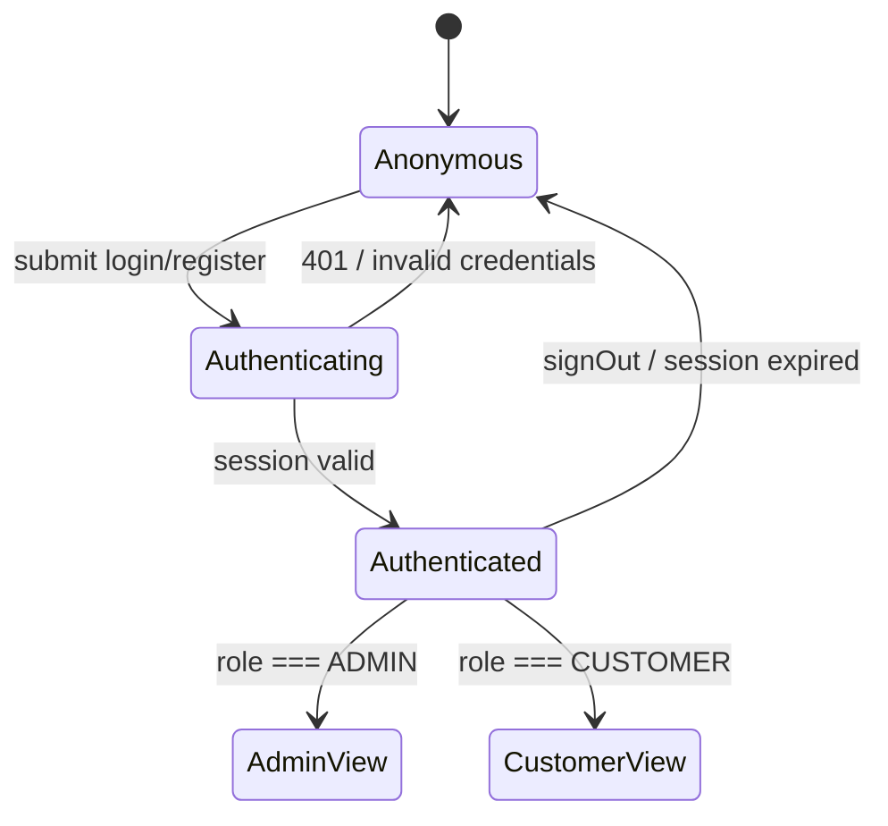
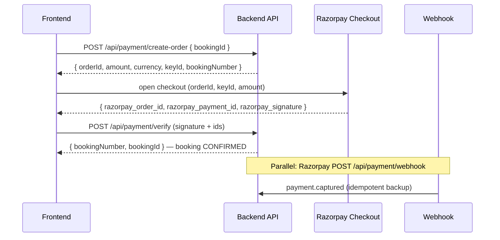
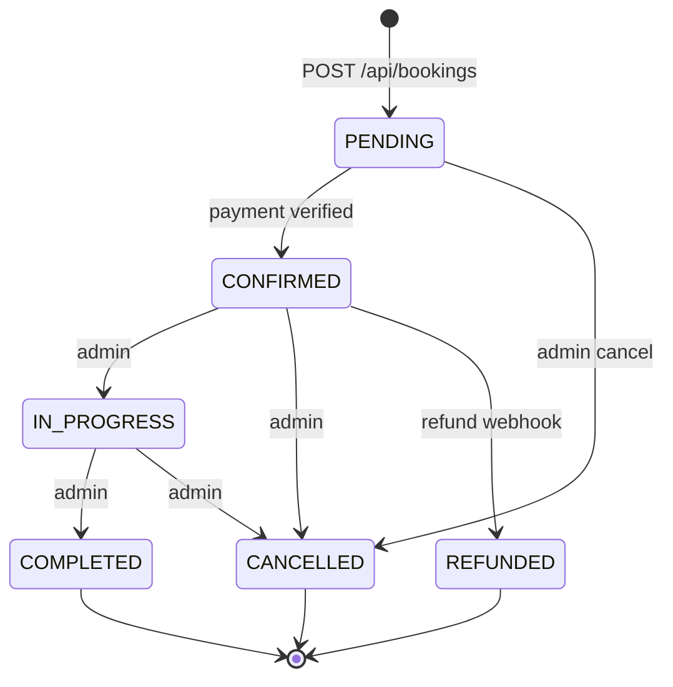
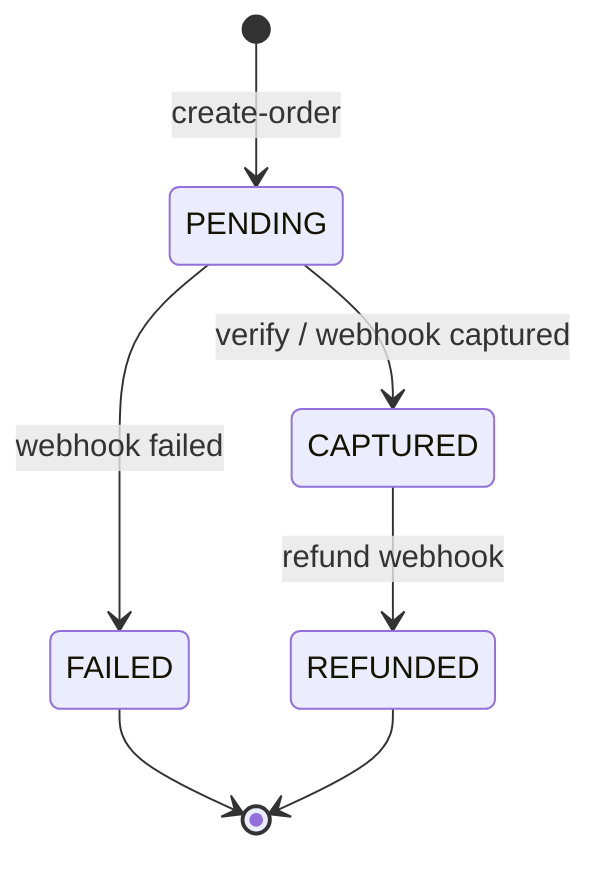
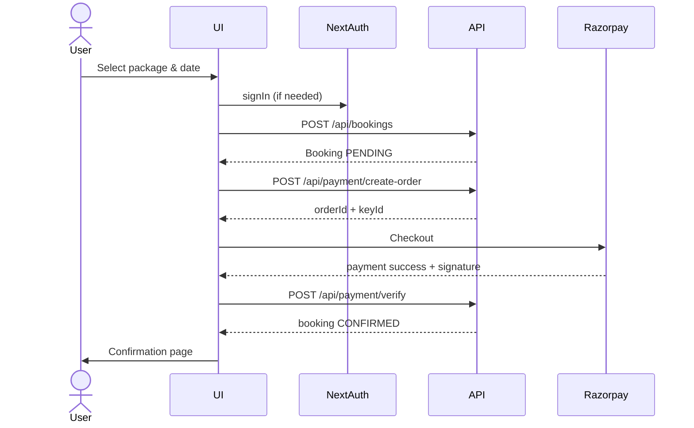
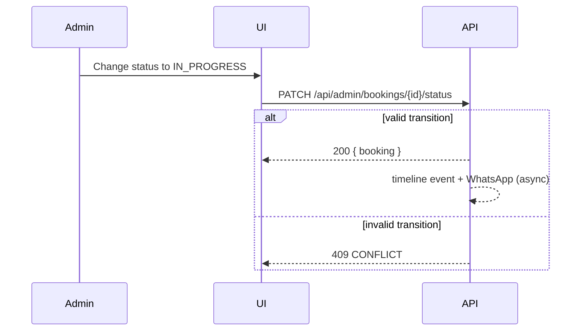

# Frontend API Integration Guide

**Audience:** Frontend engineers, designers, and AI agents building the new UI.  
**Status:** Contract document — backend verified (TypeScript, ESLint, tests, build, Prisma all pass).  
**Source of truth:** Machine-readable spec at `GET /api/openapi` · Swagger UI at `GET /api/docs`.

This document describes **how the frontend should integrate** with the backend. It does not prescribe visual design. All business rules live in the backend; the frontend consumes typed responses and renders outcomes.

---

## Table of Contents

1. [Contract Basics](#1-contract-basics)
2. [Authentication Flow](#2-authentication-flow)
3. [Booking Flow](#3-booking-flow)
4. [Dashboard Flow (Customer)](#4-dashboard-flow-customer)
5. [Admin Flow](#5-admin-flow)
6. [Payment Flow (Razorpay)](#6-payment-flow-razorpay)
7. [State Diagrams](#7-state-diagrams)
8. [Sequence Diagrams](#8-sequence-diagrams)
9. [API Examples](#9-api-examples)
10. [Error Codes](#10-error-codes)
11. [Retry Strategy](#11-retry-strategy)
12. [Pagination Strategy](#12-pagination-strategy)
13. [Optimistic UI Rules](#13-optimistic-ui-rules)
14. [Loading States](#14-loading-states)
15. [Empty States](#15-empty-states)
16. [Caching Strategy](#16-caching-strategy)
17. [Server Actions vs REST](#17-server-actions-vs-rest)
18. [Future: Monorepo Layout](#18-future-monorepo-layout)

---

## 1. Contract Basics

### Response envelope

Every REST endpoint returns a discriminated union:

**Success**
```json
{
  "success": true,
  "data": { /* payload */ },
  "message": "optional human string"
}
```

**Failure**
```json
{
  "success": false,
  "error": "Human-readable message",
  "code": "VALIDATION_ERROR",
  "issues": [{ "path": "sevaDate", "message": "Seva date must be at least tomorrow" }]
}
```

**Paginated lists** nest pagination inside `data`:
```json
{
  "success": true,
  "data": {
    "data": [ /* items */ ],
    "total": 42,
    "page": 1,
    "pageSize": 20,
    "totalPages": 3
  }
}
```

### Authentication mechanism

- **Session:** NextAuth v5 JWT stored in cookie `next-auth.session-token` (or `__Secure-next-auth.session-token` in production HTTPS).
- **REST:** Send cookies automatically with `fetch(..., { credentials: "include" })` on same origin.
- **Server Components / Actions:** Session resolved server-side via `auth()` — no manual token handling.

### Session shape (`SessionUser`)

```typescript
type SessionUser = {
  id: string;
  name: string;
  email: string;
  image: string | null;
  role: "CUSTOMER" | "ADMIN";
  adminRole?: "SUPER_ADMIN" | "OPERATIONS_ADMIN" | "CONTENT_ADMIN" | "SUPPORT_ADMIN";
};
```

### Public vs protected routes

| Scope | Auth required | Notes |
| --- | --- | --- |
| `/api/services`, `/api/packages`, `/api/faqs`, … | No | Rate-limited |
| `/api/auth/register` | No | Rate-limited (10 / 15 min) |
| `/api/bookings`, `/api/payment/*` | Yes (customer or admin) | Cookie session |
| `/api/admin/*` | Yes (admin + RBAC permission) | See permission matrix |

---

## 2. Authentication Flow

### Registration (REST)

```
POST /api/auth/register
Body: { name, email, password, phone? }
→ 201 { success: true, data: { id, name, email } }
```

Password rules (mirror in client Zod): min 8 chars, uppercase, lowercase, digit.

### Login (NextAuth)

```
POST /api/auth/callback/credentials   (via signIn("credentials", { email, password }))
GET  /api/auth/session              (current session)
POST /api/auth/signout              (logout)
```

Google OAuth: `signIn("google")` when `GOOGLE_CLIENT_ID` is configured.

### Frontend routing rules

| Condition | Redirect |
| --- | --- |
| Unauthenticated → `/dashboard`, `/book` (payment step) | `/login?callbackUrl=…` |
| `role !== ADMIN` → `/admin/*` | `/dashboard` |
| Authenticated → `/login`, `/register` | `/dashboard` or `callbackUrl` |

Middleware (`proxy.ts`) enforces customer/admin route guards server-side. **Do not rely on UI-only checks.**

### State diagram — auth session



---

## 2b. Service Pages (dynamic content)

Service pages are **fully content-driven** — hero, benefits, highlights, how-it-works, trust badges, included items, packages, FAQs, gallery, testimonials, and related services all come from the backend. **No service-specific hardcoding in the frontend.**

### Aggregate endpoint (one round-trip)

```
GET /api/services/{slug}
Auth: none (rate-limited)
→ 200 { success: true, data: ServicePage }
→ 404 NOT_FOUND (unknown/inactive slug)
```

**`ServicePage`**
```typescript
type ServicePage = {
  service: {
    id: string;
    type: ServiceType;
    name: string;
    slug: string;
    shortDesc: string;
    description: string;
    icon: string | null;
    image: string | null;
    metaTitle: string | null;   // use for <title>
    metaDesc: string | null;    // use for meta description
    pageSections: ServicePageSections | null; // see below
  };
  packages: Package[];          // active packages + items (price/originalPrice are decimal strings)
  faqs: Faq[];                  // service-scoped + global (serviceType null)
  gallery: PublicGalleryImage[];
  testimonials: Testimonial[];  // approved, scoped to this service
  relatedServices: ServiceCard[]; // computed (other active services), not stored
};
```

**`ServicePageSections`** (all fields optional; render only what exists, fall back to UI defaults when `null`):
```typescript
type ServicePageSections = {
  hero?: { tagline?: string; badges?: string[]; backgroundImage?: string };
  benefits?: { icon?: string; title: string; description?: string }[];
  highlights?: { icon?: string; title: string; description?: string }[];
  howItWorks?: { step: number; title: string; description: string; icon?: string }[];
  trustBadges?: { icon?: string; text: string }[];
  includedItems?: string[];
};
```

`pageSections` is stored as JSON on `ServiceCategory` and **validated on read** — a malformed row returns `null` rather than breaking the page.

### Filterable content endpoints

Each list can also be fetched independently, scoped by `serviceType`:

| Endpoint | Scoping |
| --- | --- |
| `GET /api/services` | All active services (cards) |
| `GET /api/services/{slug}` | Full aggregate (recommended for service pages) |
| `GET /api/packages?serviceSlug=` or `?serviceType=` | Packages for a service |
| `GET /api/faqs?serviceType=` | Service FAQs **+ global** (omit param for all) |
| `GET /api/gallery?serviceType=&limit=` | Public gallery (omit param for general) |
| `GET /api/testimonials?serviceType=&featured=&limit=` | Approved testimonials |

`serviceType` ∈ `BHANDARA | BRAHMIN_BHOJ | GAU_SEVA | SADHU_BHOJAN | FESTIVAL_SEVA | ANNADAN_SEVA | VIDHWA_SEVA`.

### Example

```typescript
const result = await api<ServicePage>("/api/services/bhandara");
if (result.success) {
  const { service, packages, faqs, gallery, testimonials, relatedServices } = result.data;
  // render service.pageSections.benefits, howItWorks, etc.
}
```

> **Migration note:** the old `app/services/[slug]/page.tsx` hardcoded SEO + trust badges. During the rebuild, drive everything from `GET /api/services/{slug}` (or call `getServicePage()` directly in an RSC).

---

## 3. Booking Flow

### Wizard steps (recommended UI mapping)

| Step | Data source | Backend touchpoint |
| --- | --- | --- |
| 1. Service | `GET /api/services` | Public |
| 2. Package | `GET /api/packages?serviceSlug=` | Public |
| 3. Date & details | Client form | Validated on submit |
| 4. Review | Client state | — |
| 5. Payment | See [Payment Flow](#6-payment-flow-razorpay) | Requires auth |

### Create booking

```
POST /api/bookings
Auth: required
Body: CreateBookingRequest
→ 201 { success: true, data: Booking }
```

**CreateBookingRequest**
```typescript
{
  packageId: string;       // cuid
  sevaDate: string;        // ISO datetime, ≥ 24h from now
  sevaLocation: "Vrindavan" | "Mathura";
  guestCount?: number;     // default 1, max 10000
  dedicatedTo?: string;
  gotra?: string;
  occasion?: string;
  specialInstructions?: string;
  couponCode?: string;
}
```

Initial status is always **`PENDING`**. Payment moves it to **`CONFIRMED`**.

### Server Action alternative

```typescript
import { createBookingAction } from "@/app/actions/bookings";

const result = await createBookingAction(formData);
// result: ServiceResult<BookingDto> — dates/amounts as numbers & ISO strings
```

Use **Server Actions** for same-origin forms; use **REST** for mobile/external clients.

---

## 4. Dashboard Flow (Customer)

### Pages → API mapping

| UI area | Endpoint | Purpose |
| --- | --- | --- |
| Booking list | `GET /api/bookings?page=&pageSize=&status=` | Own bookings only |
| Booking detail | `GET /api/bookings/{id}` | Full detail + timeline + payment |
| Notifications | *(future)* `GET /api/notifications` | In-app notifications |

### Booking detail includes

- `user`, `package` (+ `serviceCategory`, `items`)
- `payment` (status, amount)
- `payment`, `mediaProofs`, `proofTimeline`

Customer can only access bookings where `booking.userId === session.user.id` (403 otherwise).

### Recommended dashboard UX states

| Booking status | Primary CTA |
| --- | --- |
| `PENDING` | "Complete Payment" → payment flow |
| `CONFIRMED` | "View details" — awaiting seva |
| `IN_PROGRESS` | Show timeline progress |
| `COMPLETED` | View proof |
| `CANCELLED` / `REFUNDED` | Read-only summary |

---

## 5. Admin Flow

### Access control

- Requires `session.user.role === "ADMIN"` **and** active `Admin` record.
- Each admin API checks a **permission** (see `docs/permission-matrix.md`).
- Hide UI actions the user's `adminRole` cannot perform — but always handle 403 from API.

### Admin areas → endpoints

| Area | List | Create | Update | Delete |
| --- | --- | --- | --- | --- |
| Bookings | `GET /api/admin/bookings` | — | `PATCH …/status` | — |
| Proofs | `GET …/proof` | `POST …/proof` | — | — |
| Packages | `GET /api/admin/packages` | `POST` | `PATCH /{id}` | `DELETE /{id}` |
| Blog | `GET /api/admin/blog` | `POST` | `PATCH /{id}` | `DELETE /{id}` |
| Gallery | `GET /api/admin/gallery` | `POST` | `PATCH /{id}` | `DELETE /{id}` |
| Testimonials | — | — | `PATCH /{id}` | `DELETE /{id}` |
| Messages | — | — | `PATCH /{id}` | `DELETE /{id}` |
| Settings | `GET /api/admin/settings` | `POST` (upsert) | — | — |
| Analytics | `GET /api/admin/stats` | — | — | — |

### Status transitions (admin)

Allowed transitions (enforce in UI — backend rejects invalid ones with `409 CONFLICT`):

| From | Allowed to |
| --- | --- |
| `PENDING` | `CONFIRMED`, `CANCELLED` |
| `CONFIRMED` | `IN_PROGRESS`, `CANCELLED`, `REFUNDED` |
| `IN_PROGRESS` | `COMPLETED`, `CANCELLED` |
| `COMPLETED`, `CANCELLED`, `REFUNDED` | *(terminal)* |

```
PATCH /api/admin/bookings/{id}/status
Body: { status, adminNotes?, completionNotes? }
```

Also available: `PUT /api/bookings/{id}` (same service, admin-only).

---

## 6. Payment Flow (Razorpay)

### Prerequisites

- User authenticated
- Booking exists with `status === "PENDING"`
- Env: `NEXT_PUBLIC_RAZORPAY_KEY_ID` on client

### Steps



### Create order

```
POST /api/payment/create-order
Body: { bookingId: string }
→ 200 { orderId, amount, currency, bookingNumber, keyId }
```

**Idempotent:** If an order already exists for the booking, returns the existing `orderId`.

### Client-side Razorpay (example)

```typescript
const options = {
  key: data.keyId,
  amount: data.amount * 100, // paise — verify against Razorpay docs for your SDK version
  currency: data.currency,
  name: "Vrindavan Bhandara",
  description: data.bookingNumber,
  order_id: data.orderId,
  handler: async (response: RazorpayResponse) => {
    await fetch("/api/payment/verify", {
      method: "POST",
      credentials: "include",
      headers: { "Content-Type": "application/json" },
      body: JSON.stringify({
        bookingId,
        razorpay_order_id: response.razorpay_order_id,
        razorpay_payment_id: response.razorpay_payment_id,
        razorpay_signature: response.razorpay_signature,
      }),
    });
  },
};
```

### Verify payment

```
POST /api/payment/verify
→ 200 { bookingId, bookingNumber }
```

**Idempotent:** Calling verify again on an already-confirmed booking returns success.

### Failure modes

| Scenario | Code | UI action |
| --- | --- | --- |
| User closes Razorpay modal | — | Keep booking PENDING; allow retry |
| Invalid signature | `PAYMENT_ERROR` (402) | Show support message; do not mark confirmed |
| Rate limited | `RATE_LIMITED` (429) | Disable pay button; show retry timer |
| Booking not PENDING | `CONFLICT` (409) | Redirect to booking detail |

Webhook handles server-side confirmation if the client verify fails (network drop). UI should poll `GET /api/bookings/{id}` until `status === "CONFIRMED"` after payment.

---

## 7. State Diagrams

### Booking lifecycle



### Payment record lifecycle



---

## 8. Sequence Diagrams

### End-to-end booking + payment (happy path)



### Admin status update



---

## 9. API Examples

### Typed fetch helper (recommended)

```typescript
type ApiSuccess<T> = { success: true; data: T; message?: string };
type ApiFailure = {
  success: false;
  error: string;
  code: string;
  issues?: { path: string; message: string }[];
};

export async function api<T>(
  path: string,
  init?: RequestInit
): Promise<ApiSuccess<T> | ApiFailure> {
  const res = await fetch(path, {
    ...init,
    credentials: "include",
    headers: { "Content-Type": "application/json", ...init?.headers },
  });
  return res.json();
}
```

### Register

```typescript
const result = await api<{ id: string; name: string; email: string }>(
  "/api/auth/register",
  {
    method: "POST",
    body: JSON.stringify({ name, email, password, phone }),
  }
);

if (!result.success) {
  if (result.code === "VALIDATION_ERROR" && result.issues) {
    // map issues[].path → form field errors
  }
  if (result.code === "CONFLICT") {
    // email already exists
  }
}
```

### List bookings (paginated)

```typescript
const result = await api<PaginatedResponse<Booking>>(
  "/api/bookings?page=1&pageSize=10&status=PENDING"
);

if (result.success) {
  const { data: items, total, page, pageSize, totalPages } = result.data;
}
```

### Public catalog (no auth)

```typescript
const services = await api<ServiceCategory[]>("/api/services");
const packages = await api<Package[]>("/api/packages?serviceSlug=bhandara");

// Full dynamic service page in one call (see §2b):
const page = await api<ServicePage>("/api/services/bhandara");

// Scoped content:
const faqs = await api<Faq[]>("/api/faqs?serviceType=GAU_SEVA");
const gallery = await api<PublicGalleryImage[]>("/api/gallery?serviceType=BHANDARA&limit=12");
```

---

## 10. Error Codes

Stable codes for programmatic handling. Full reference: `docs/error-codes.md`.

| Code | HTTP | When | Frontend action |
| --- | --- | --- | --- |
| `VALIDATION_ERROR` | 422 | Zod failed | Show field errors from `issues[]` |
| `UNAUTHORIZED` | 401 | No session | Redirect to login |
| `FORBIDDEN` | 403 | Wrong role/owner | Show "access denied"; hide action |
| `NOT_FOUND` | 404 | Missing resource | 404 page or toast |
| `CONFLICT` | 409 | Duplicate / bad state transition | Explain conflict; refresh data |
| `RATE_LIMITED` | 429 | Too many requests | Backoff + disable submit |
| `PAYMENT_ERROR` | 402 | Bad Razorpay signature | Support message; allow retry |
| `INTERNAL_ERROR` | 500 | Server error | Generic error; retry once |

**Never** display raw 500 stack traces. Log `code` + `error` client-side for debugging.

---

## 11. Retry Strategy

### When to retry

| Code | Retry? | Strategy |
| --- | --- | --- |
| `INTERNAL_ERROR` | Yes (max 2) | Exponential backoff: 1s, 3s |
| `RATE_LIMITED` | Yes | Wait until window resets; show countdown if `Retry-After` present |
| `VALIDATION_ERROR` | No | Fix input |
| `UNAUTHORIZED` | No | Re-auth |
| `FORBIDDEN` | No | — |
| `NOT_FOUND` | No | — |
| `CONFLICT` | No | Refresh entity state first |
| `PAYMENT_ERROR` | No | User must re-initiate checkout |

### Payment-specific

1. **Do not** auto-retry `POST /api/payment/verify` with the same signature — idempotent but unnecessary.
2. **Do** poll `GET /api/bookings/{id}` after Razorpay success if verify times out.
3. **Do** allow user to click "Retry payment" → calls `create-order` again (returns existing order if still open).

### Rate limits (backend)

| Bucket | Limit | Routes |
| --- | --- | --- |
| Auth | 10 / 15 min | register, login |
| API | 60 / min | most `/api/*` |
| Payment | 5 / min | create-order, verify |

---

## 12. Pagination Strategy

### Query parameters

| Param | Default | Min | Max | Notes |
| --- | --- | --- | --- | --- |
| `page` | `1` | `1` | — | 1-indexed |
| `pageSize` | `20` (admin bookings: `20`, min `5`) | `1` | `50` | Invalid values fall back to defaults |

### Response shape

Always read from `response.data` when `success === true`:

```typescript
type PaginatedResponse<T> = {
  data: T[];
  total: number;
  page: number;
  pageSize: number;
  totalPages: number;
};
```

### UI patterns

- **Infinite scroll:** increment `page` until `page >= totalPages`.
- **Page buttons:** bind to `page` query param; disable next when `page === totalPages`.
- **Empty page after delete:** if `data.length === 0 && page > 1`, decrement page and refetch.
- **Admin list filters:** pass `status`, `search` as additional query params (admin bookings).

---

## 13. Optimistic UI Rules

Optimistic updates improve perceived speed but **must respect backend authority**.

### Safe for optimistic UI

| Action | Optimistic behavior | Rollback trigger |
| --- | --- | --- |
| Mark message read (admin) | Set `isRead: true` locally | 4xx/5xx response |
| Toggle gallery `isFeatured` | Flip toggle immediately | Revert on failure |
| Filter/tab changes | Instant UI filter | N/A (client-only until fetch) |

### Never optimistic

| Action | Reason |
| --- | --- |
| Payment / booking creation | Money + inventory; wait for server |
| Admin status transitions | Must respect `canTransition` rules |
| Delete package/booking | Irreversible or soft-delete side effects |
| Coupon application | Server validates eligibility |

### Pattern (TanStack Query)

```typescript
useMutation({
  mutationFn: markRead,
  onMutate: async (id) => {
    await queryClient.cancelQueries({ queryKey: ["messages"] });
    const previous = queryClient.getQueryData(["messages"]);
    queryClient.setQueryData(["messages"], (old) => optimisticMarkRead(old, id));
    return { previous };
  },
  onError: (_err, _id, ctx) => {
    queryClient.setQueryData(["messages"], ctx?.previous);
  },
  onSettled: () => queryClient.invalidateQueries({ queryKey: ["messages"] }),
});
```

---

## 14. Loading States

### Granularity

| Scope | Pattern | Example |
| --- | --- | --- |
| Page | Route-level `loading.tsx` or skeleton layout | Dashboard bookings list |
| Section | Skeleton cards matching final layout | Package grid |
| Action | Button `disabled` + spinner | "Pay Now", "Save" |
| Background | Subtle indicator; keep stale data visible | Refetch on focus |

### Rules

1. **Show skeletons, not spinners**, for content areas > 200ms expected load.
2. **Disable submit** during mutations; prevent double-submit on payment.
3. **Preserve scroll** on paginated admin tables when refetching.
4. **Streaming RSC:** use `Suspense` boundaries per section (stats vs table), not one global blocker.

### Payment button states

```
idle → loading (create-order) → razorpay_open → verifying → success | error
```

Disable all navigation away during `verifying` unless user confirms cancel.

---

## 15. Empty States

| Context | Condition | Suggested copy direction |
| --- | --- | --- |
| Customer bookings | `total === 0` | "No sevas booked yet" + CTA → `/book` |
| Filtered bookings | `total === 0` with `status` filter | "No {status} bookings" + clear filter |
| Admin bookings search | no results | "No bookings match '{query}'" |
| Packages (public) | empty array | "Packages coming soon" |
| Testimonials | empty | Hide section or show placeholder |
| Admin messages | empty | "Inbox zero" |
| Proof timeline | `proofTimeline.length === 0` | "Proof will appear after seva completes" |
| Notifications | empty | "You're all caught up" |

Always distinguish **empty** (zero total) from **error** (fetch failed) from **loading**.

---

## 16. Caching Strategy

Recommended stack: **TanStack Query v5** (already in project) + Next.js RSC for initial data.

### Stale times (starting points)

| Query key | `staleTime` | `gcTime` | Invalidation trigger |
| --- | --- | --- | --- |
| `services`, `packages` (public) | 5 min | 30 min | Manual refresh |
| `faqs`, `seva-stats`, `testimonials` | 10 min | 1 hr | — |
| `bookings` (customer list) | 30 sec | 5 min | After create/verify payment |
| `booking-detail` | 0 (always stale) | 5 min | After payment poll confirms |
| `admin-bookings` | 30 sec | 5 min | After status PATCH |
| `admin-stats` | 1 min | 10 min | Tab focus refetch |

### Server Components

- Use RSC for **initial** public/marketing data (SEO, TTFB).
- Use client TanStack Query for **interactive** lists, filters, mutations.

### Do not cache

- Payment verify responses
- Auth session (use NextAuth `useSession` / server `auth()`)
- Admin mutations — always invalidate related lists

### Prefetch

- Prefetch `GET /api/bookings/{id}` on list row hover (customer dashboard).
- Prefetch next page: `queryClient.prefetchQuery` when `page < totalPages`.

---

## 17. Server Actions vs REST

Both call the **same services**. Choose based on consumer:

| Use case | Prefer |
| --- | --- |
| Next.js App Router forms (same origin) | Server Actions (`app/actions/*`) |
| Mobile app / external client | REST (`/api/*`) |
| Razorpay client callback | REST (`/api/payment/verify`) |
| OpenAPI-generated clients | REST |

**Server Actions return `ServiceResult<T>`** directly (not HTTP envelope):

```typescript
type ServiceResult<T> =
  | { ok: true; data: T; message?: string }
  | { ok: false; code: ErrorCode; error: string; issues?: FieldIssue[] };
```

Map `ok: false` → same UI error handling as REST `success: false`.

Available actions:
- `registerAction` — `app/actions/auth.ts`
- `createBookingAction`, `updateBookingStatusAction` — `app/actions/bookings.ts`
- `createPaymentOrderAction`, `verifyPaymentAction` — `app/actions/payments.ts`

---

## 18. Future: Monorepo Layout

Not required for Phase 2 UI work, but plan for when the platform expands (admin app, mobile, etc.):

```
vrindavanbhandara/
├── apps/
│   ├── web/                 # Next.js customer frontend
│   └── admin/               # Optional separate admin app
├── packages/
│   ├── contracts/           # Shared Zod schemas + DTOs (from lib/validations)
│   ├── ui/                  # Design system components
│   ├── config/              # Shared TS/ESLint/Tailwind
│   ├── types/               # SessionUser, ApiResponse, PaginatedResponse
│   └── utils/               # formatCurrency, formatDate
├── prisma/
├── docs/
└── scripts/
```

**Migration path:** extract `lib/validations`, `types/index.ts`, and `lib/api/result.ts` into `packages/contracts` first — zero runtime change, maximum reuse.

---

## Roadmap Reference

| Phase | Scope | Status |
| --- | --- | --- |
| **1** | Backend, architecture, DB, tests, OpenAPI, docs | ✅ Complete |
| **2** | Premium UI, design system, Open Design, a11y, responsive | 🚧 Next |
| **3** | Razorpay, R2, Resend, WhatsApp, analytics integrations (prod wiring) | 🚧 Planned |
| **4** | Security audit, load testing, SEO, perf, Vercel, CI/CD, monitoring | 🚧 Planned |

---

## Quick Reference Links

| Resource | Path |
| --- | --- |
| OpenAPI JSON | `/api/openapi` |
| Swagger UI | `/api/docs` |
| API summary | `docs/api-reference.md` |
| Error codes | `docs/error-codes.md` |
| Permissions | `docs/permission-matrix.md` |
| Service map | `docs/service-map.md` |
| Backend architecture | `docs/backend-architecture.md` |

---

*Last updated: Phase 2 backend baseline verified. Frontend should treat this document + OpenAPI as the integration contract.*
